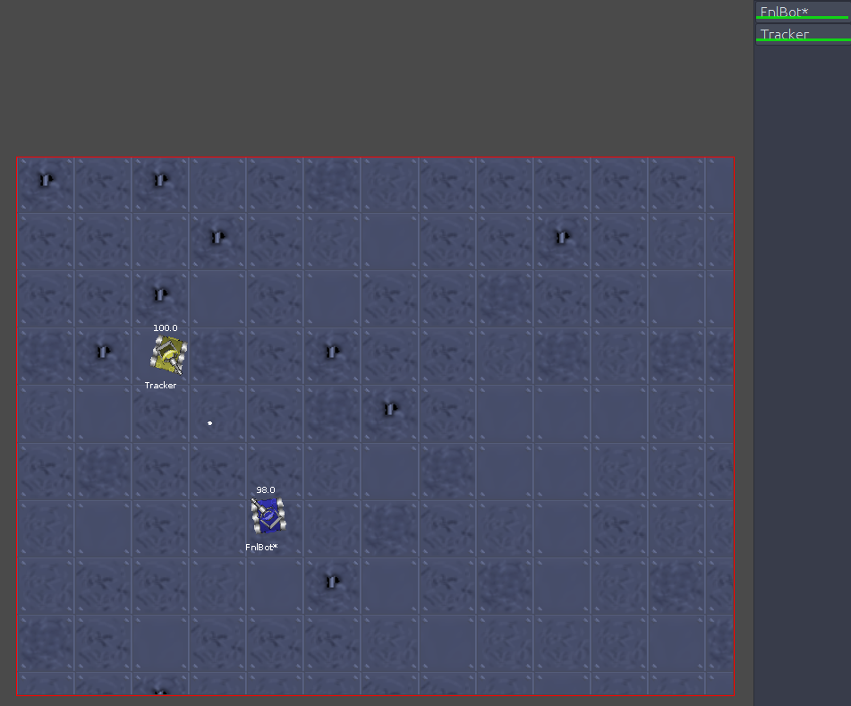

# Robocode_AI

Using Reinforcement Learning with Q-Learning, training can be conducted using this open-source java code base for training a robot tank. 

Implemented Learning Methods: 
* Qlearn 
* Sarsa 
* Neural Network Q-function approximation

